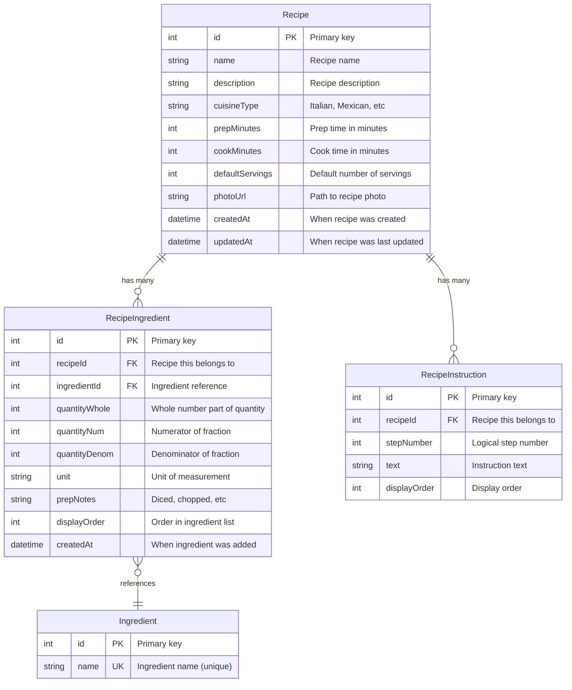
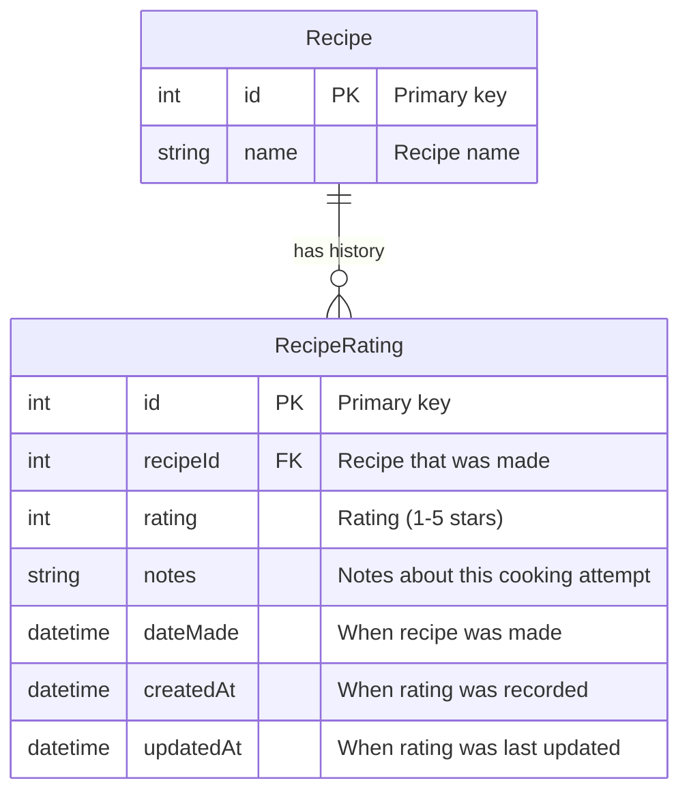
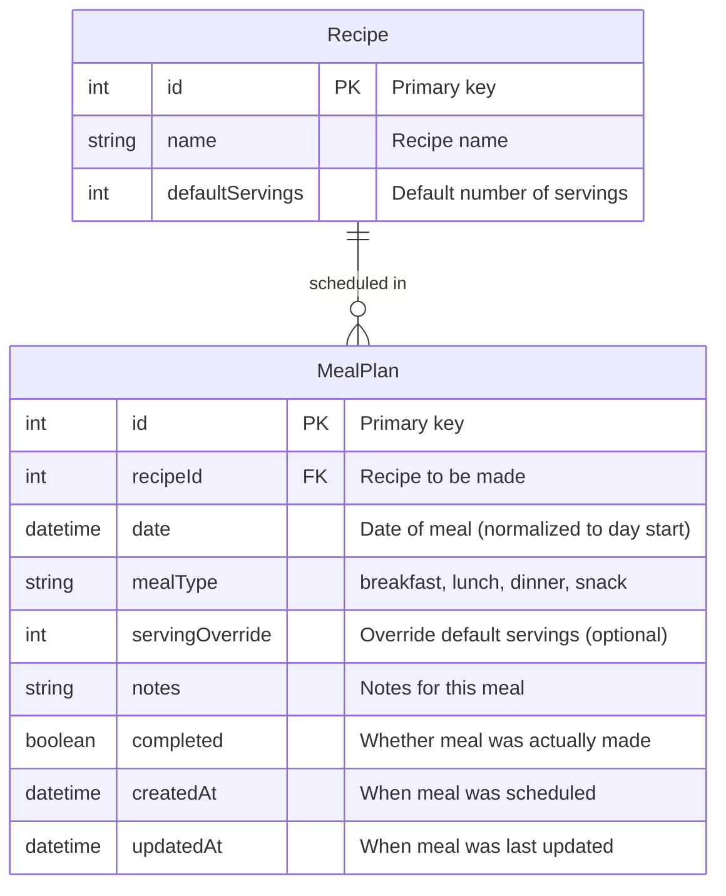
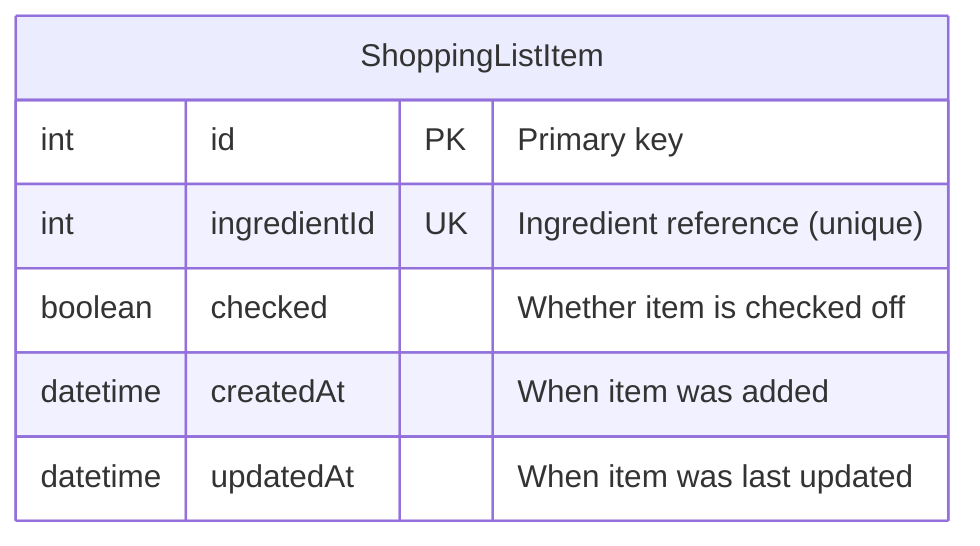

# Entity Relationship Diagram - Single-User Meal Planner

## Overview

This document provides entity relationship diagrams for the single-user Meal Planner database schema. Both visual (Mermaid) and text-based representations are included.

---

## Complete ER Diagram (Mermaid)

```mermaid
erDiagram
    Recipe ||--o{ RecipeIngredient : contains
    Recipe ||--o{ RecipeInstruction : contains
    Recipe ||--o{ RecipeRating : "rated via"
    Recipe ||--o{ MealPlan : "scheduled in"

    Ingredient ||--o{ RecipeIngredient : "used in"
    Ingredient ||--o| IngredientCustomization : "has preference"
    Ingredient }o--|| IngredientCategory : "belongs to"

    Recipe {
        int id PK
        string name
        string description
        string cuisineType
        int prepMinutes
        int cookMinutes
        int defaultServings
        string photoUrl
        datetime createdAt
        datetime updatedAt
    }

    RecipeIngredient {
        int id PK
        int recipeId FK
        int ingredientId FK
        int quantityWhole
        int quantityNum
        int quantityDenom
        string unit
        string prepNotes
        int displayOrder
        datetime createdAt
    }

    RecipeInstruction {
        int id PK
        int recipeId FK
        int stepNumber
        string text
        int displayOrder
    }

    RecipeRating {
        int id PK
        int recipeId FK
        int rating
        string notes
        datetime dateMade
        datetime createdAt
        datetime updatedAt
    }

    Ingredient {
        int id PK
        string name UK
        int categoryId FK
        string aliases
        string typicalUnit
        datetime createdAt
        datetime updatedAt
    }

    IngredientCategory {
        int id PK
        string name UK
        int displayOrder
        string color
        datetime createdAt
    }

    IngredientCustomization {
        int id PK
        int ingredientId FK_UK
        string preferredUnit
        string notes
    }

    MealPlan {
        int id PK
        int recipeId FK
        datetime date
        string mealType
        int servingOverride
        string notes
        boolean completed
        datetime createdAt
        datetime updatedAt
    }

    ShoppingListItem {
        int id PK
        int ingredientId UK
        boolean checked
        datetime createdAt
        datetime updatedAt
    }
```

---

## Recipe Module ER Diagram



**Key Relationships:**
- One Recipe has many RecipeIngredients (1:N)
- One Recipe has many RecipeInstructions (1:N)
- One Ingredient is used in many RecipeIngredients (1:N)
- Unique constraint: one RecipeIngredient per recipe+ingredient pair

**Cascade Deletes:**
- Deleting Recipe deletes all RecipeIngredients
- Deleting Recipe deletes all RecipeInstructions

---

## Ingredient Module ER Diagram

```mermaid
erDiagram
    Ingredient }o--|| IngredientCategory : "belongs to"
    Ingredient ||--o| IngredientCustomization : "has preference"

    Ingredient {
        int id PK "Primary key"
        string name UK "Ingredient name (unique)"
        int categoryId FK "Category reference (optional)"
        string aliases "Alternative names (comma-separated)"
        string typicalUnit "Default unit for this ingredient"
        datetime createdAt "When ingredient was created"
        datetime updatedAt "When ingredient was last updated"
    }

    IngredientCategory {
        int id PK "Primary key"
        string name UK "Category name (unique)"
        int displayOrder "Sort order in shopping lists"
        string color "Color for UI display (hex)"
        datetime createdAt "When category was created"
    }

    IngredientCustomization {
        int id PK "Primary key"
        int ingredientId FK_UK "Ingredient reference (unique)"
        string preferredUnit "User's preferred unit for this ingredient"
        string notes "Personal notes about ingredient"
    }
```

**Key Relationships:**
- One IngredientCategory has many Ingredients (1:N)
- One Ingredient has one optional IngredientCustomization (1:0..1)
- categoryId is nullable (ingredients can be uncategorized)

**Cascade Deletes:**
- Deleting Ingredient deletes IngredientCustomization
- Deleting Category sets Ingredient.categoryId to null

---

## Rating & History Module ER Diagram



**Key Relationships:**
- One Recipe has many RecipeRatings (1:N)
- Represents cooking history (same recipe can be made multiple times)
- Unique constraint: one rating per recipe per date

**Use Cases:**
- Track recipe improvements over time
- Remember what worked and what didn't
- Rate each cooking attempt separately

**Cascade Deletes:**
- Deleting Recipe deletes all RecipeRatings

---

## Meal Planning Module ER Diagram



**Key Relationships:**
- One Recipe can be scheduled many times (1:N)
- Unique constraint: one meal per recipe+date+mealType combination

**Business Rules:**
- Same recipe can be scheduled for different meals on same day
- Cannot schedule same recipe twice for same meal on same day
- servingOverride used to scale ingredients for shopping list

**Cascade Deletes:**
- Deleting Recipe behavior: TBD (restrict or cascade)

---

## Shopping List Module ER Diagram



**Key Relationships:**
- No foreign key to Ingredient (intentional design)
- Standalone tracking of check state
- Unique constraint: one entry per ingredientId

**Design Rationale:**
- Shopping list is dynamically generated from MealPlans
- This table only tracks which ingredients are checked off
- No FK allows flexibility (can track ingredients not in database)
- Ephemeral state (cleared after shopping trip)

---

## Relationship Summary

### One-to-Many Relationships

| Parent | Child | Cardinality | On Delete |
|--------|-------|-------------|-----------|
| Recipe | RecipeIngredient | 1:N | CASCADE |
| Recipe | RecipeInstruction | 1:N | CASCADE |
| Recipe | RecipeRating | 1:N | CASCADE |
| Recipe | MealPlan | 1:N | TBD |
| Ingredient | RecipeIngredient | 1:N | RESTRICT |
| IngredientCategory | Ingredient | 1:N | SET NULL |

### One-to-One Relationships

| Parent | Child | Cardinality | On Delete |
|--------|-------|-------------|-----------|
| Ingredient | IngredientCustomization | 1:0..1 | CASCADE |

### No Foreign Keys

| Table | Reason |
|-------|--------|
| ShoppingListItem | Allows flexibility, ephemeral state |

---

## Unique Constraints

### Simple Unique Constraints

| Table | Field(s) | Purpose |
|-------|----------|---------|
| Ingredient | name | Prevent duplicate ingredients |
| IngredientCategory | name | Prevent duplicate categories |
| IngredientCustomization | ingredientId | One customization per ingredient |
| ShoppingListItem | ingredientId | One check state per ingredient |

### Composite Unique Constraints

| Table | Fields | Purpose |
|-------|--------|---------|
| RecipeIngredient | recipeId + ingredientId | One entry per ingredient per recipe |
| RecipeInstruction | recipeId + stepNumber | Prevent duplicate step numbers |
| RecipeRating | recipeId + dateMade | One rating per recipe per day |
| MealPlan | recipeId + date + mealType | Prevent duplicate meal scheduling |

---

## Indexes

### Primary Keys (Automatic)

All tables have auto-increment integer primary key (indexed by default)

### Foreign Key Indexes

| Table | Index | Purpose |
|-------|-------|---------|
| RecipeIngredient | recipeId | Fast ingredient lookup for recipe |
| RecipeIngredient | ingredientId | Fast recipe lookup for ingredient |
| RecipeInstruction | recipeId | Fast instruction lookup |
| RecipeRating | recipeId | Fast rating lookup |

### Search/Filter Indexes

| Table | Index | Purpose |
|-------|-------|---------|
| Ingredient | name | Fast ingredient search/autocomplete |
| Ingredient | categoryId | Fast category filtering |
| MealPlan | date | Fast calendar queries |

---

## Data Flow Diagrams

### Recipe Creation Flow

```
User creates recipe
    ↓
Recipe record created
    ↓
RecipeIngredient records created (for each ingredient)
    ├→ Reference existing Ingredient (or create new)
    └→ Store quantity as fraction (whole, num, denom)
    ↓
RecipeInstruction records created (for each step)
    └→ Store step number and text
```

### Meal Planning Flow

```
User schedules recipe for date/mealType
    ↓
Verify recipe exists
    ↓
Check for duplicate (same recipe+date+mealType)
    ↓
Create MealPlan record
    └→ Optional: override servings
```

### Shopping List Generation Flow

```
User requests shopping list for date range
    ↓
Query MealPlan records in date range
    ↓
For each MealPlan:
    ├→ Get Recipe
    ├→ Get RecipeIngredients
    ├→ Scale quantities by servingOverride
    └→ Aggregate by Ingredient
    ↓
Group by IngredientCategory
    ↓
Apply check status from ShoppingListItem
    ↓
Return categorized shopping list
```

### Recipe Rating Flow

```
User cooks recipe and rates it
    ↓
Create RecipeRating record
    ├→ recipeId
    ├→ rating (1-5)
    ├→ dateMade (today)
    └→ notes (optional)
    ↓
Calculate average rating for recipe
    └→ Used for sorting "top rated recipes"
```

---

## Text-Based ER Representation

### Recipe Module

```
RECIPE
├── id (PK)
├── name
├── description
├── cuisineType
├── prepMinutes
├── cookMinutes
├── defaultServings
├── photoUrl
├── createdAt
├── updatedAt
└── relationships:
    ├── has many → RECIPE_INGREDIENT
    ├── has many → RECIPE_INSTRUCTION
    ├── has many → RECIPE_RATING
    └── has many → MEAL_PLAN

RECIPE_INGREDIENT
├── id (PK)
├── recipeId (FK → RECIPE)
├── ingredientId (FK → INGREDIENT)
├── quantityWhole
├── quantityNum
├── quantityDenom
├── unit
├── prepNotes
├── displayOrder
├── createdAt
└── constraints:
    └── UNIQUE(recipeId, ingredientId)

RECIPE_INSTRUCTION
├── id (PK)
├── recipeId (FK → RECIPE)
├── stepNumber
├── text
├── displayOrder
└── constraints:
    └── UNIQUE(recipeId, stepNumber)
```

### Ingredient Module

```
INGREDIENT
├── id (PK)
├── name (UNIQUE)
├── categoryId (FK → INGREDIENT_CATEGORY, nullable)
├── aliases
├── typicalUnit
├── createdAt
├── updatedAt
└── relationships:
    ├── belongs to → INGREDIENT_CATEGORY (optional)
    ├── used in many → RECIPE_INGREDIENT
    └── has one → INGREDIENT_CUSTOMIZATION (optional)

INGREDIENT_CATEGORY
├── id (PK)
├── name (UNIQUE)
├── displayOrder
├── color
├── createdAt
└── relationships:
    └── contains many → INGREDIENT

INGREDIENT_CUSTOMIZATION
├── id (PK)
├── ingredientId (FK → INGREDIENT, UNIQUE)
├── preferredUnit
└── notes
```

### Rating & History Module

```
RECIPE_RATING
├── id (PK)
├── recipeId (FK → RECIPE)
├── rating
├── notes
├── dateMade
├── createdAt
├── updatedAt
└── constraints:
    └── UNIQUE(recipeId, dateMade)
```

### Meal Planning Module

```
MEAL_PLAN
├── id (PK)
├── recipeId (FK → RECIPE)
├── date
├── mealType
├── servingOverride
├── notes
├── completed
├── createdAt
├── updatedAt
└── constraints:
    └── UNIQUE(recipeId, date, mealType)
```

### Shopping List Module

```
SHOPPING_LIST_ITEM
├── id (PK)
├── ingredientId (UNIQUE, no FK)
├── checked
├── createdAt
└── updatedAt
```

---

## Comparison: Multi-User vs Single-User Schema

### Removed from Multi-User Version

```diff
- USER table (entire table removed)
- RECIPE.userId (foreign key removed)
- RECIPE_RATING.userId (foreign key removed)
- MEAL_PLAN.userId (foreign key removed)
- INGREDIENT_CATEGORY.userId (nullable field removed)
- INGREDIENT_CATEGORY.isSystemCategory (boolean removed)
- INGREDIENT_CUSTOMIZATION.userId (foreign key removed)
- SHOPPING_LIST_ITEM.userId (foreign key removed)
- All userId-based indexes
- All userId-based unique constraints
```

### Modified Unique Constraints

```diff
Multi-User:
- UNIQUE(userId, ingredientId) → IngredientCustomization
- UNIQUE(userId, ingredientId) → ShoppingListItem
- UNIQUE(userId, name) → IngredientCategory
- UNIQUE(userId, recipeId, dateMade) → RecipeRating
- UNIQUE(userId, recipeId, date, mealType) → MealPlan

Single-User:
+ UNIQUE(ingredientId) → IngredientCustomization
+ UNIQUE(ingredientId) → ShoppingListItem
+ UNIQUE(name) → IngredientCategory
+ UNIQUE(recipeId, dateMade) → RecipeRating
+ UNIQUE(recipeId, date, mealType) → MealPlan
```

### Relationship Changes

```diff
Multi-User:
- USER → RECIPE (1:N)
- USER → RECIPE_RATING (1:N)
- USER → MEAL_PLAN (1:N)
- USER → INGREDIENT_CUSTOMIZATION (1:N)

Single-User:
+ No user relationships
+ All entities standalone or related to other entities
```

---

## Database Normalization

### Normal Forms Achieved

**1NF (First Normal Form):** ✅
- All attributes are atomic
- No repeating groups
- Each field contains single value

**2NF (Second Normal Form):** ✅
- All 1NF requirements met
- All non-key attributes depend on entire primary key
- No partial dependencies

**3NF (Third Normal Form):** ✅
- All 2NF requirements met
- No transitive dependencies
- All attributes depend directly on primary key

### Intentional Denormalization

**Quantity Storage (RecipeIngredient):**
```
quantityWhole, quantityNum, quantityDenom
```

**Rationale:**
- Store fractions precisely (not as decimals)
- Preserve cooking measurement accuracy
- Avoid floating-point errors
- Could normalize to separate Quantity table, but performance/complexity tradeoff not worth it

**Aliases Field (Ingredient):**
```
aliases: "flour, all-purpose flour, AP flour"
```

**Rationale:**
- Comma-separated list instead of separate table
- Simpler for small lists
- Could normalize to IngredientAlias table if needed
- Current approach sufficient for use case

---

## Future Schema Extensions

### Potential Additions (Not Implemented)

**Recipe Tags:**
```
RECIPE_TAG
├── id (PK)
├── recipeId (FK)
├── tag (string)
└── UNIQUE(recipeId, tag)
```

**Pantry Tracking:**
```
PANTRY_ITEM
├── id (PK)
├── ingredientId (FK)
├── quantity
├── unit
├── expirationDate
└── location
```

**Meal Prep:**
```
MEAL_PREP_BATCH
├── id (PK)
├── recipeId (FK)
├── datePrepared
├── servingsMade
├── expirationDate
└── notes
```

**Nutrition Information:**
```
NUTRITION_INFO
├── id (PK)
├── recipeId (FK, UNIQUE)
├── calories
├── protein
├── carbs
├── fat
└── servingSizeOverride
```

---

## Summary

The single-user schema:

✅ **Simplified** - Removed all user-related complexity
✅ **Complete** - Preserves all valuable features
✅ **Normalized** - Proper 3NF design
✅ **Performant** - Appropriate indexes
✅ **Maintainable** - Clear relationships and constraints
✅ **Extensible** - Easy to add future features

**Core Entities:** 10 tables
**Relationships:** 7 foreign keys
**Constraints:** 9 unique constraints
**Indexes:** 8 custom indexes (plus PK indexes)
